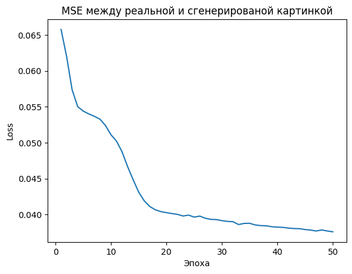
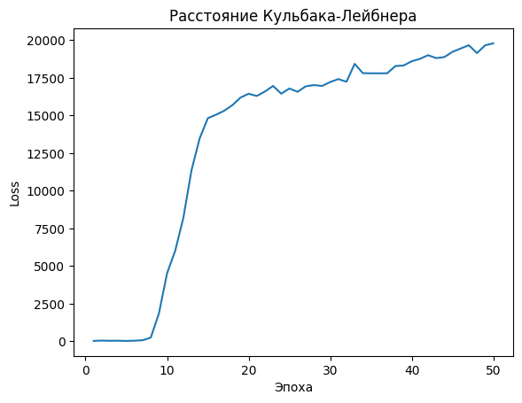
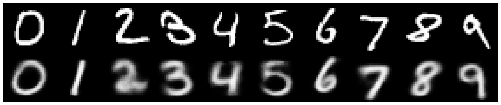
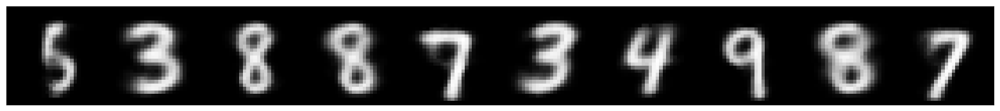

# Conditional Variational Autoencoder

Данный модуль содержит реализацию условного вариационного автоэнкодера, обученного на рисование цифр

## Описание модели

- Модель состоит из энкодера - **свёрточной нейронной сети**, и декодера - **многослойного перцептрона**
- Обучение методом **ADAM** 
- Функция активации - **ReLU**
- Оптимизация **MSE** пикселей сгенерированной картинки от реальной и расстояния **Кульбака-Лейбница**
- Использование **трюка с репараметризацией**
- Возможность **очищать** реальные изображения и **генерировать** новые
- Для тестирования использовался энкодер из 3 свёрток 5x5 глубины 4 и декодер с полносвязными внутренними слоями размеров 50, 150 и 250.

## Данные

Для тестирования использовался датасет MNIST с изображениями рукописных цифр размера 28x28

🔗 [Mnist](https://www.kaggle.com/datasets/vikramtiwari/mnist-numpy)

**Важно:** после скачивания положите файл в папку `data`.

## Метрики модели

| MSE | KLD |
|----------|-----------|
| 0.816    | 0.708    | 

### Графики потерь:

### Предсказания реальных цифр:

### Генерация случайных цифр:

## Примечание

- Метрики отражают лучшие полученные значения. Более подробные эксперименты и визуализации представлены в ноутбуке: [`notebooks/test_encoder.ipynb`](../notebooks/test_encoder.ipynb).