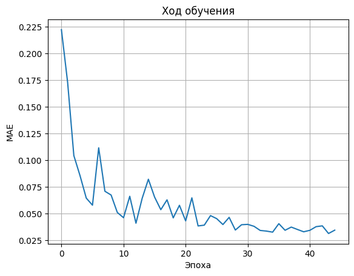
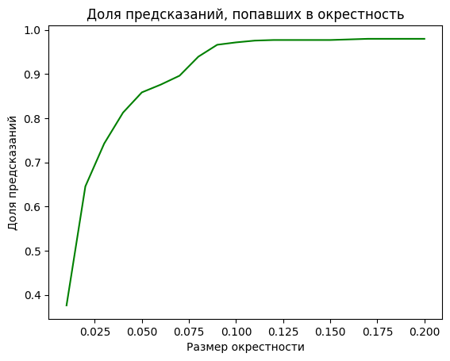

# Graph Neural Network

Данный модуль содержит реализацию графовой нейронной сети

## Описание модели

- Реализована сверточная графовая нейронная сеть с возможностью менять число слоёв
- Обучение методами **Adam** и **Стохастического градиментного спуска** 
- Функция активации - **leakyReLu**
- Для подготовки данных использовались **динамический пэддинг**, **стандартизация размера ребра атома** и **One-Hot Encoding**
- Для тестирования использовалась 5-слойная модель со скрытыми слоями размеров 512, 256, 128 и 64. Число эпох - 45.

## Данные

Для тестирования использовался датасет для задачи по расчету ширины запрещенной зоны для двумерных дихалькогенидов переходных металлов

🔗 [dichalcogenides_public](https://github.com/HSE-LAMBDA/IDAO-2022)

**Важно:** после скачивания положите файл в папку `data`.

## Метрики качества модели

Основной метрикой при решении данной задачи является eWt - доля предсказаний, попавших в окрестность 0.02. 

| eWt | MAE | MSE | R^2 |
|----------|-----------|--------|---------|
| 0.646   | 0.034   | 0.01  | 0.963  |

### График потерь:

### Доля предиктов, попавших в окрестность:

## Примечание

- Метрики отражают лучшие полученные значения. Более подробные эксперименты и визуализации представлены в ноутбуке: [`notebooks/test_gnn.ipynb`](../notebooks/test_gnn.ipynb).
