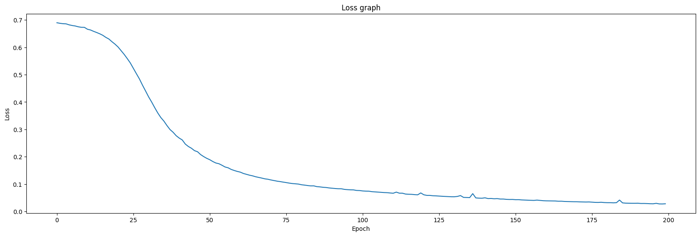
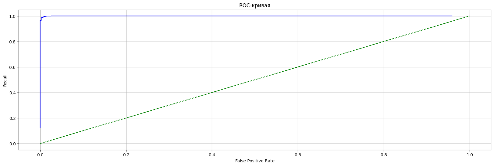

# Multilayer Perceptron

Данный модуль содержит реализацию многослойного перцептрона

## Описание модели

- Реализован многослойный перцептрон с возможностью изменять **число слоёв** и **количество нейронов** в них
- Обучение методом **стохастического градиентного спуска** 
- Функция активации - **сигмоида**
- Для тестирования использовалась 4-слойная модель со скрытыми слоями размеров 150, 100 и 60. Число эпох - 200.

## Данные

Для тестирования использовался датасет для классификации ядовитых грибов:

🔗 [Mushroom dataset](https://archive.ics.uci.edu/ml/datasets/Mushroom)

**Важно:** после скачивания положите файл в папку `data`.

## Метрики качества модели

| Accuracy | Precision | Recall | F-score |
|----------|-----------|--------|---------|
| 0.993    | 0.989     | 0.999  | 0.994   |

### График потерь:

### ROC-кривая:

## Примечание

- Метрики отражают лучшие полученные значения. Более подробные эксперименты и визуализации представлены в ноутбуке: [`notebooks/test_perceptron.ipynb`](../notebooks/test_perceptron.ipynb).
