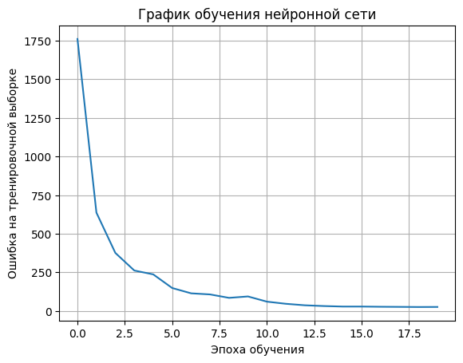
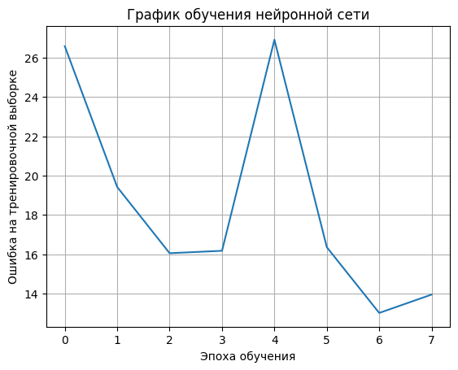
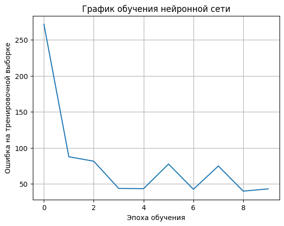
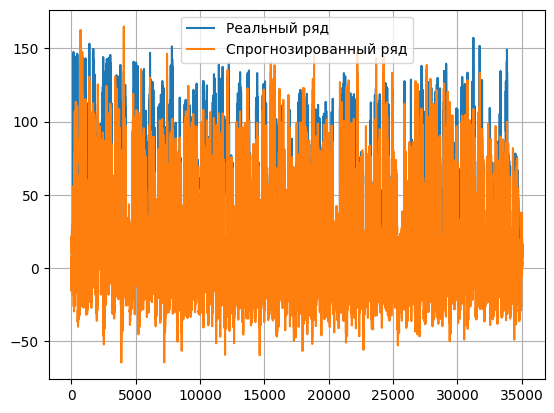
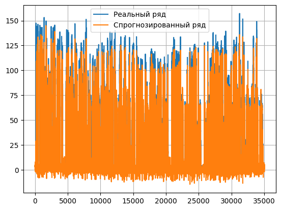
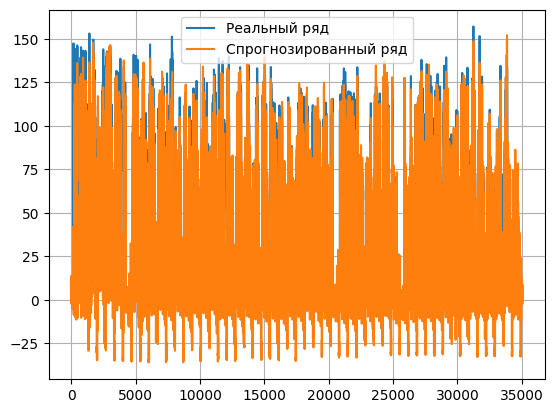

# Recurrent Neural Networks: RMLP, LSTM, GRU

Данный модуль содержит реализации 3 рекуррентных нейронных сетей

## Описание моделей

### RMLP

- Реализован многослойный рекуррентный перцептрон с 1 слоём скрытых состояний, размер которого можно менять
- Обучение методами **стохастического градиентного спуска** и **adam**
- Функция активации - **гиперболический тангенс**
- Предсказание временного ряда **по батчам** и **целиком**
- Для тестирования использовалась модель со скрытым слоем размером 50. Число эпох - 20, скорость обучения - 0.0001.

### LSTM

- Реализован классический алгоритм LSTM
- Обучение методами **стохастического градиентного спуска** и **adam** 
- Функции активации - **сигмоида** и **гиперболический тангенс**
- Для тестирования использовалась модель со скрытым слоем размера 50. Число эпох - 8, скорость обучения - 0.001.

### GRU

- Реализован классический алгоритм GRU
- Обучение методами **стохастического градиентного спуска** и **adam** 
- Функции активации - **сигмоида** и **гиперболический тангенс**
- Для тестирования использовалась модель со скрытым слоем размера 50. Число эпох - 10, скорость обучения - 0.001.

## Данные

Для тестирования использовался датасет для предсказания потребления производство электроэнергии:

🔗 [Steel industry data](http://archive.ics.uci.edu/ml/datasets/Steel+Industry+Energy+Consumption+Dataset)

**Важно:** после скачивания положите файл в папку `data`.

## Метрики качества моделей

| Модель| R-square (по батчам) | R-square (на всём ряду) | RMSE (на всём ряду)| RMSE (на всём ряду) |
|----------|----------|-----------|--------|---------|
| RMLP    | 0.952   | 0.62     | 0.017  | 0.131   |
| LSTM  | 0.974    | 0.963    | 0.002  | 0.041   |
| GRU   | 0.92   | 0.837     | 0.007  | 0.086   |

 <table> <tr> <th>RMLP: График потерь</th> <th>LSTM: График потерь</th> <th>GRU: График потерь</th> </tr> <tr> <td></td> <td></td> <td></td> </tr> <tr> <th>RMLP: Предсказание</th> <th>LSTM: Предсказание</th> <th>GRU: Предсказание</th> </tr> <tr> <td></td> <td></td> <td></td> </tr> </table> 

## Примечание

- Метрики отражают лучшие полученные значения. Более подробные эксперименты и визуализации представлены в ноутбуке: [`notebooks/rnn_test.ipynb`](../notebooks/rnn_test.ipynb).
- Обучение моделей происходило на батчах, поэтому при предсказании всего ряда метрики не такие высоки. В особенности, это заметно для RMLP, который очень плохо справляется с достаточно длинными временными рядами.
